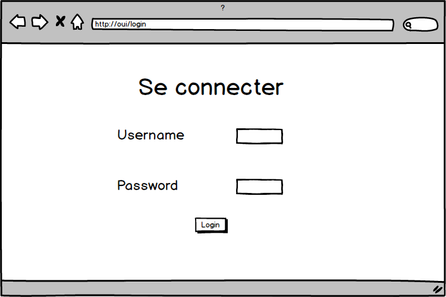
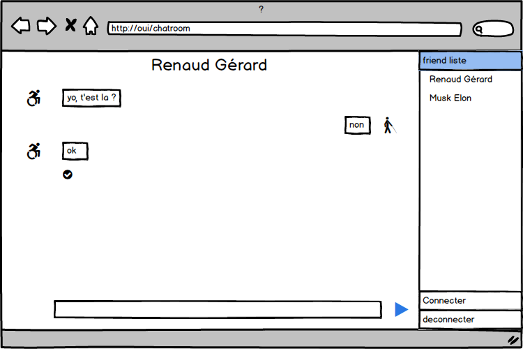

#README
##javascript

*Session 1 javascript*
---------------

On à ici crée notre espace de travail :
- telechargement de `webstorm`
- installation de `js node` ,`xpress` ,`ws` ,...
- creation du projet et ajout de la partie serveur à partir de code déjà existant
- creation d'un git hub pour le projet
> https://github.com/JulianDesmartin/untitled23

*Session 2 javascript*
---------------

- découverte de la documention `Markdown`
- création du readme sur notre projet Git
- réalisation de maquette sur `Balsamiq`

- écriture des pages html en utilisant `Bootstrap`
